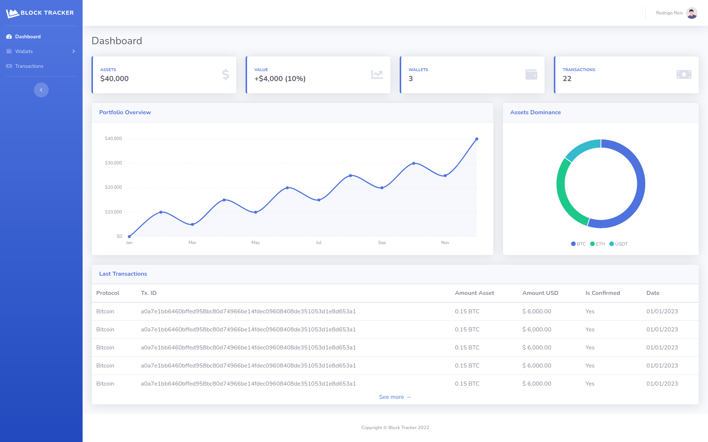

<div align="center">

## Block Tracker
### Track your wallet's transactions and the portfolio's value over time


[](https://github.com/rfreis/block-tracker/actions/workflows/ci.yaml)
[](https://codecov.io/github/rfreis/block-tracker?branch=main)

[](https://github.com/rfreis/block-tracker/wiki/Roadmap)

</div>

# Table of contents

* [Introduction](#introduction)
* [Supported protocols](#supported-protocols)
* [Requirements](#requirements)
* [Development](#development)
* [Running application](#running-application)
* [Stopping application](#stopping-application)
* [Local bash](#local-bash)
* [Logs](#logs)
* [Tests](#tests)
* [Emails](#emails)
* [Workers](#workers)
    * [Blockbook websocket](#blockbook-websocket)
    * [Celery workers](#celery-workers)
* [Exchange rates](#exchange-rates)
* [Screenshots](#screenshots)
* [Contact and Support](#contact-and-support)

# Introduction

This is an Open Source project with the goal to track wallet's transactions and the portfolio values over time.

Block Tracker uses `Django`, `Celery` and `Postgresql`.

# Supported protocols

Initially it supports only Bitcoin with P2PKH/P2WPKH addresses. The project aims to support multiple assets in multiple protocols.

# Requirements

To run this app you must have installed:

* docker
* docker-compose

# Development

Before commiting new changes, make sure you have `pre-commit` installed:

```bash
pre-commit install
```

# Running application

```bash
make start-local
```

For the first time, you can use `make build` to download and build the containers.

# Stopping application

```bash
make stop
```

# Local bash

```bash
make local-bash
```

# Logs

```bash
make logs
```

# Tests

```bash
make test # shortcut to e2e and unit tests
make unit
make e2e
make integration
```

# Emails

We use [mailhog](https://github.com/mailhog/MailHog) to display the emails sent by SMTP on development server.

The emails sent to SMTP server on `localhost:1025` gets available on [localhost:8025](http://localhost:8025).

# Workers

## Blockbook websocket

```bash
python manage.py wss_blockbook <ProtocolType attribute>
python manage.py wss_blockbook BITCOIN
python manage.py wss_blockbook BITCOIN_TESTNET
```

## Celery workers

```bash
python -m celery -A app worker
python -m celery -A app beat
```

# Exchange rates

We use [Coingecko API](https://www.coingecko.com/en/api/documentation) to fetch exchange rates. We try to get a daily rate for the max period as possible and a 5 minutes rate using the `celery beat & worker`.

# Screenshots

## Dashboard

Dashboard with KPIs, Portfolio Overview, Asset Dominance and Last Transactions



## Sent emails

Email sent for an user with a new transaction on his wallet


# Contact and Support

Got interested and want to support our project? Reach me out by email on [rodrigreis@gmail.com](mailto:rodrigreis@gmail.com)
